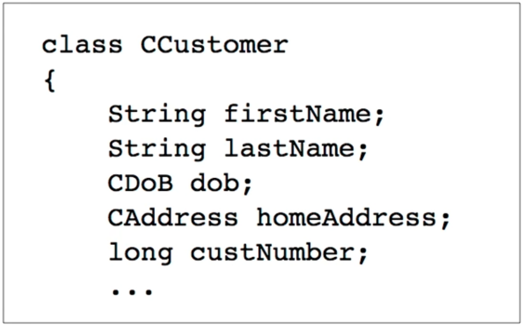
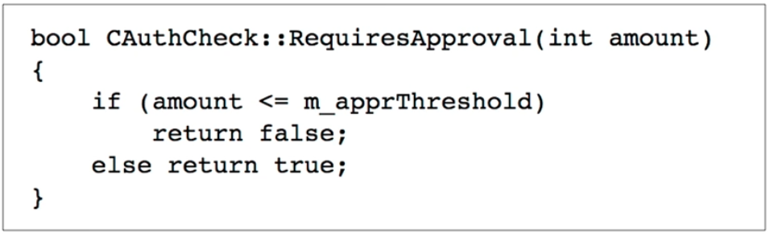

# STI - Attacking Application Logic

  * Transcript from https://www.youtube.com/watch?v=UgPismmHayA
  * This also resumes Chapter 11 of _Web Application Hackers Handbook - 2nd edition_
  * Chapter 11 can be found [here 🔗](./ch11_attacking_application_logic.pdf)

## Logic Flaws

  * No common signature, such as found on SQLi
  * Often an assumption a developer made
  * Difficult to find and eliminate


## Real life examples
### I. Asking the Oracle
  
  * "Remember me" function sets a permanent cookie
  * Containing an encrypted string that contains
    * Name
    * User ID
    * Volatile data to make it unique and predictable, including machine IP address
  * Screen name also saved in encrypted form as __ScreenName__

#### Assumption

  * It's OK to use same encryption algorithm to encrypt both cookies
  * But user can control __ScreenName__
  * And the app decrypts that cookie, showing the result on the screen

#### The Attack

  * Copy the __RememberMe__ cookie into the __ScreenName__ cookie 
  * The app decrypts it and shows the result
      * `Welcome, marcus | 734 | 192.168.4.282.282750184`
  * Now change screen name to
      * `admin | 1 | 192.168.4.282750184`
  * Log out, log back in, and copy the new __ScreenName__ cookie to the __RemmeberMe__ cookie
  * Attacker is now admin!
  * Encryption was 3DES and unbreakable, but it didn't matter

#### Hack Steps

  * Look for items which are encrypted, not hashed → hashed items are not (easily) reversible
  * With data from the user → we control the data
  * Substitute other encrypted values
  * Try to cause an error that reveals the decrypted value

### II. Fooling a Password change Function

  * Form for password change asks
      * Username
      * Existing password
      * New password
      * Confirm new password
  * Administrators have a form that can change any password, implemented by the same server-side script
  * Administrator's form doesn't ask for existing password

#### Assumption

  * When a request comes in without an existing password, that indicates that it came from an administrator 


#### The Attack

  * Submit a password change without any existing password
  * Reset anyone's password
  * This really happened in the AOL AIM Entreprise Gateway application

#### Hack Steps

  * Try deleting each parameter, one by one
  * Delete the name as well as the value
  * Try it at each step of the process

### III. Proceeding to Checkout

> 1. Browse the product catalog, and add items to the shopping basket.
> 2. Return to the shopping basket, and finalize the order.
> 3. Enter payment information.
> 4. Enter delivery information.

#### Assumption

  * Users will perform steps in sequence
  * A user on the last step must have entered payment details

#### The Attack

  * "Forced Browsing"
      * Circumvent controls that make the steps occur in sequence
  * Proceed directly from step 2 to step 4
  * Get product without paying for it

#### Hack Steps

  * Try skipping stages, doing a single stage more than once, and doing earlier stages after later ones
  * Stages may use different URLs or parameter values
  * Guess assumptions and violate them
  * Watch for interesting error messages

### IV. Rolling your Own Insurance

  * App lets users obtain quotes for insurance, and, if desired submit an insurance application online
  * It used a dozen stages
  
>1. Applicant submits basic information, 
>    and either preferred monthly premium or amount 
>    of desired insurance payout
>
>  1.a. App computes values the applicant 
>  did not specify
>  
>2. Across several stages, applicant supplies
>    other personal details: health, occupation, 
>    pastimes, etc.
>  
>3. Finally application is sent to an underwriter 
>  
>   3.a. Underwriter uses the same web app to review 
>   the details and decide whether to approve the 
>   application, or modify the initial quote to reflect 
>   additional risks

  * Each stage uses a shared component to process each parameter of user data
  * Component parsed all data in each _POST_ request into name/value pairs and updated state information


#### Assumption

  * Each request will contain only the parameters requested in the current HTML form
  * Developers did not consider a user who submitted extra parameters

#### The Attack

  * Supply valid data at earlier stage
      * But then overwrite it with later requests resetting the same value
      * No validation was performed on the unexpected parameters
  * Allowed an _XSS injection_ that revealed personal information of other applicants
  * Purchase insurance at an arbitrary price
      * Replace monthly premium at later stages
  * Force approval
      * Underwriter sets parameters in same web app to indicate disapproval
      * Attacker can set them, bypassing the actual underwriter 

#### Hack Steps

  * Take parameters from one stage, and add them to requests from another stage → see if they are tested for consistency 
  * Take parameters used by one type of user and try submitting them as another type of user

### V. Breaking the Bank

  * App lets existing bank customers register for online banking
  * Collects name, address, and date of birth
      * But no PIN or any other secret
  * Forwards request to back-end system
  * Mails an application pack to the customer containing instructions, a phone number for activation, and a one-time password

#### Assumption

  * Designers regarded this process as safe, with three layers of protection
      * Some personal data required to start the process to deter impostors
      * Secret one-time password sent by email ; difficult for attacker to steal
      * Customer required to call in and authenticate with personal information and selected digits from a PIN

###### Data Structure

  * Customer information stored in a database as this object



#### The Attack

  * Same data object  used for online banking and registration
  * Account details shown on main e-banking page were generated from the customer number
  * Main banking application required several levels of authentication and access control to access the data

#### Hack Steps

  1. Log in with valid credentials
  2. Using the authenticated session, go to registration function and submit a different customer's personal information
      * The app overwrites the _CCustomer_ object with a new object relating to the targeted customer
  3. Return to the main application functionality and access the other customer's account  

###### Fundamental Flaw

  * Same database object can be written two ways
  * Main banking function allows writing after strict authentication
      * The designers think the user is known
  * Registration function allows writing without authentication
      * These users are unknown

### VI. Beating a Business Limit

  * Financial personnel can transfer funds between company bank accounts and customers and suppliers
  * Application prevents users from performing transfers over $10k
  * Larger transfers require a senior manager's approval

###### The Code



  * Any transaction that is too large requires approval

#### The Attack

  * Transfer a negative amount
      * such as `-$100,000.00`
  * No approval required because it's below $10k
  * Money flows in opposite direction 

#### Numeric Limits

> → A retailing application may prevent a user from ordering more than the number of units available in stock
> → A banking application may prevent a user from making bill payments that exceeds their current account balance
> → An insurance application may adjust its quotes based on age threshold

  * __Try negative values at each step__


### VII. Cheating on Bulk Discounts

  * User software products
  * Discount if a bundle of items purchased together
      * 25% discount for buying antivirus, firewall, and antispam all together

#### Assumption

  * Discount applied when items added to shopping basket
  * Developers assumed that shopper would buy everything in the basket

#### The Attack

  * Add __everything__ (every item possible to the basket)
      * Get discounted price
  * Remove unwanted items from basket
      * Discounted price persists 

#### Hack Steps

  * 

### VII. Escaping from Escaping

  * Found in the web interface for a NIDS
  * User-controlled input placed in an operating system command
      * Developers understood the code injection risk
      * Added backslash to escape these characters:
          * `; | & < > ' \s \n\r`

#### The Attack

  * Developers forgot to escape the backslash `\` itself
  * Attacker enters:
      * `foo\;ls`
  * Application converts it to: 
      * `foo\\;ls`
  * Which allows the `;` to get through unescaped 

### IX. Invalidating Input Validation

  * Input validation system
  * SQLi filter changes all quotes to double-quotes
      * will be interpreted as literal quotes, not metacharacters 
  * Length limit __truncates__ all input to 128 characters

##### Example

  * This input:

`admin' --`

  * Changes to this, which fails to bypass the login:

```SQL
SELECT * FROM users WHERE username = ´admin´´--´ and password = ´´;
```

#### The Attack

  * Submit a username of 127 `a`'s followed by a single quotation mark, and password foo
      * `{{[a]*127}}`
  * App adds another `'`, but the length limit removes it
  * This causes a SQL syntax error
      * ```SQL
      SELECT * FROM users WHERE username = '{{[a]*127}}'' and password = 'foo'
      ```
  * Submit the same username, and a password of `or 1=1--`
  * Query becomes this, bypassing the login:
      * ```SQL
      SELECT * FROM users WHERE username = '{{[a]*127}}'' and password = 'or 1=1--'
      ```
  * `''` is interpreted as a literal `'`, not a metacharacter


### X. Abusing a Search Function

  * Application provides access to a huge archive of information
      * Accessible only to paying subscribers
  * Provided powerful search engine
  * Anonymous user can perform a query to see what's available 
      * But must pay to read the found articles

#### Assumption

  * User cannot get useful information from the search function before paying
  * Document titles were typically cryptic, like 
      * "Annual Results 2010"
      * "Press Release 08-03-2011"
      * etc.

#### The Attack

  * Query searches full text of documents
  * Guess at contents, and deduce them from the number of found documents
  * Like blind SQLi


#### Real World Application

  * Authors have used this technique to brute-force a password from a configuration file stored in a wiki
  * With the searches:
    > Password=A
    > Password=B
    > Password=BA
    > ...

### XI. Snarfing Debug Messages

  * App is new and buggy, so it puts out detailed error messages containing :

> * The user's identity 
> * The _token_ for the current session
> * The URL being accessed
> * All the parameters supplied with the request that generated the error

#### Assumption

  * There's no important information in the error message
  * Because the user can get all that data by inspecting requests and responses from the browser anyway

#### The Flaw

  * Error message was not built from the browser's inforamtion
  * It came from a stored container on the server-side
  * Not session-based
  * Error condition copies data to the container, and then displays information copied from that container

#### Race Condition

  * If two users have errors at nearly the same time
  * One user's data is copied to the container
  * But then displayed to a different user

#### Exploitation

  * This is even worse than the race condition
  * Attacker polls error container URL repeatedly
  * Log results each time they change and get:

> * A set of usernames that could be used in a password-guessing attack
> * A set of session tokens that could be used to hijack sessions
> * A set of user-supplied input, which may contain passwords and other sensitive items


### XII. Racing Against the Login

  * Robust, multistage login process
  * Users required to supply several different credentials
  * Authentication mechanism had been subjected to numerous design reviews and penetration tests
  * Owners had high confidence in it

#### The Bug

  * Occasionally a customer logged in and gained access to a different user's account 
  * This seemed random and non-repeatable
  * Eventually the bank discovered that this happened when two users logged in at precisely the same time
      * But not reliably

#### The Flaw

  * Application stored a key identifier about each newly authenticated user in a static, non-session, variable
  * This variable's value was read back an instant later
  * If a different thread, processing another login, wrote to that variable in between, the account would change

## Avoiding Logic Flaws

  * Document every aspect of the application's design thoroughly
      * So an outsider can understand every assumption the designer made
  * Require clear comments in source code documenting:
      * The purpose and intended use of each component
      * Assumptions made by each component about anything that is outside of its direct control
      * References to all client code that uses the component
  * During security review, reflect on every assumption made in the design
      * Imagine circumstances that violate those assumptions
      * Focus on conditions that user can control


## Summary

TODO

## Questions

https://portswigger.net/web-security/logic-flaws#what-are-business-logic-vulnerabilities